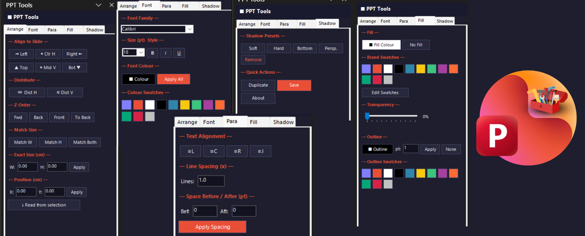

# PPT ToolBox

<p align="center">
  
</p>

> A PowerPoint add-in that puts professional formatting controls one click away — without leaving your slide.

[](https://github.com/ravitejachillara/PPT-ToolBox)
[](https://github.com/ravitejachillara/PPT-ToolBox)
[](https://github.com/ravitejachillara/PPT-ToolBox)
[](LICENSE)

---

## Screenshots

<p align="center">
  <!-- Replace the images below with actual screenshots after first run -->
  <!-- Suggested: capture each task pane tab at ~300px width and save to docs/ -->
</p>

| Arrange & Size | Font & Fill | Shadow & Quick |
|:--------------:|:-----------:|:--------------:|
|  |  |  |

> **Note:** To add screenshots — open PowerPoint with the add-in loaded, take a snip of each tab, save to `docs/` as `screenshot-arrange.png`, `screenshot-font.png`, `screenshot-shadow.png`, then push.

---

## What it does

PPT ToolBox adds a **"PPT Tools"** toggle button to PowerPoint's **Home tab**. Clicking it opens a side panel with five tabs:

| Tab | Controls |
|-----|----------|
| **Arrange** | Align (L/C/R/T/M/B), Distribute H/V, Z-order (Fwd/Back/Front/Back), Match size, Exact W/H/X/Y in cm |
| **Font** | Family, size, Bold/Italic/Underline, colour picker, colour swatches |
| **Para** | Align L/C/R/J, line spacing, space before/after |
| **Fill** | Fill colour, No Fill, transparency slider, brand swatches, outline colour & width |
| **Shadow** | Soft / Hard / Bottom / Perspective presets, Remove |

Everything works on **multi-selection** — select 10 shapes, hit Align Left, done.

---

## Features

- **Editable colour swatches** — 12 slots, saved to `%APPDATA%\PPTToolbox\swatches.json`. Click *Edit Swatches* to replace any colour; persists across sessions. Same swatch palette shared across Fill, Font colour, and Outline.
- **No-admin install** — registers entirely in `HKCU`. No elevated rights needed, compatible with locked-down corporate machines.
- **Silent deploy** — `PPTToolbox_Setup.exe /SILENT /SUPPRESSMSGBOXES /NORESTART` for Intune/SCCM.
- **Zero dependencies** — ships as a self-contained add-in; no external packages or internet access required.

---

## Requirements

| Requirement | Minimum |
|-------------|---------|
| Windows | 10 or 11 |
| Microsoft Office | 2016, 2019, 2021, or Microsoft 365 |
| .NET Framework | 4.8 (pre-installed on all Windows 10+ machines) |
| Architecture | x86 or x64 |

---

## Installation

### Option 1 — Installer (recommended)

1. Download `PPTToolbox_Setup.exe` from [Releases](https://github.com/ravitejachillara/PPT-ToolBox/releases)
2. Run it — no admin prompt required
3. Open PowerPoint; the **PPT Tools** button appears in the Home tab

> If Windows shows "Unknown Publisher" warning: click **More info → Run anyway** (one-time per machine).

### Option 2 — Xcopy (no installer)

```bat
xcopy_deploy.bat
```

Run as the target user. Copies files to `%APPDATA%\PPTToolbox` and writes the HKCU registry key.

### Option 3 — Silent deploy (Intune / SCCM)

```bat
PPTToolbox_Setup.exe /SILENT /SUPPRESSMSGBOXES /NORESTART
```

Uninstall:

```bat
%APPDATA%\PPTToolbox\unins000.exe /SILENT
```

---

## Uninstall

**Via Control Panel** → Programs → PPT Toolbox → Uninstall

**Manual:**

```bat
reg delete "HKCU\Software\Microsoft\Office\PowerPoint\Addins\PPTToolbox" /f
rmdir /s /q "%APPDATA%\PPTToolbox"
```

---

## Building from source

### Prerequisites

- Visual Studio 2022 (Community or higher)
- Workload: **Office/SharePoint development** (install via VS Installer)
- Inno Setup 6 — [download](https://jrsoftware.org/isinfo.php)

### Build add-in

```bat
# Open PPTToolbox_VSTO\PPTToolbox.sln in Visual Studio 2022
# Switch configuration to Release, then Build > Build Solution
```

Or from a Developer Command Prompt:

```bat
msbuild PPTToolbox_VSTO\PPTToolbox\PPTToolbox.csproj /p:Configuration=Release
```

### Build installer

```bat
cd PPTToolbox_VSTO\Installer
build_installer.bat
```

Output: `PPTToolbox_VSTO\dist\PPTToolbox_Setup.exe`

---

## Project structure

```
PPTToolbox_VSTO/
├── PPTToolbox/
│   ├── BrandingConfig.cs        # All brand colours, default swatches, fonts
│   ├── SwatchStore.cs           # Persistent swatch library (%APPDATA%\…\swatches.json)
│   ├── FormattingEngine.cs      # All COM/PowerPoint operations
│   ├── RibbonPPT.cs/.xml        # Home-tab toggle button (IRibbonExtensibility)
│   ├── TaskPaneControl.cs       # Task pane event handlers
│   ├── TaskPaneControl.Designer.cs  # Task pane UI layout
│   ├── ThisAddIn.cs             # Add-in startup, CustomTaskPane wiring
│   └── Resources/
│       ├── ribbon_icon.png      # 32×32 icon for the Home tab button
│       ├── company_logo.png     # Shown in task pane footer (max 20 px height) — replace with your logo
│       └── app_icon.ico         # Installer icon
├── Installer/
│   ├── setup.iss                # Inno Setup script
│   └── build_installer.bat      # MSBuild + Inno Setup in one step
└── Deployment/
    ├── xcopy_deploy.bat          # No-installer deployment
    └── README_IT.txt             # IT department deployment guide
```

---

## Customising swatches

Swatches are stored at:

```
%APPDATA%\PPTToolbox\swatches.json
```

Example file (12 hex colours):

```json
["#1A1A2E","#E94F37","#FFFFFF","#000000","#2E86AB","#F6C90E","#3DC47E","#A83F9E","#FF6B35","#04A777","#D62246","#C0C0C0"]
```

Delete the file to reset to defaults.

---

## Troubleshooting

**Add-in not visible in ribbon**
1. PowerPoint → File → Options → Add-ins
2. Manage: **COM Add-ins** → Go
3. Check **PPT Tools** is ticked
4. If listed as *inactive*: remove it, then re-run `xcopy_deploy.bat`

**Disabled by Office Trust Center**
File → Options → Trust Center → Trust Center Settings → Trusted Locations → Add `%APPDATA%\PPTToolbox`

---

## Contributing

Pull requests are welcome. For significant changes, open an issue first to discuss what you'd like to change.

---

## Author

Made with ♥ by **Ravi Teja Chillara**

---

## License

[MIT](LICENSE)
